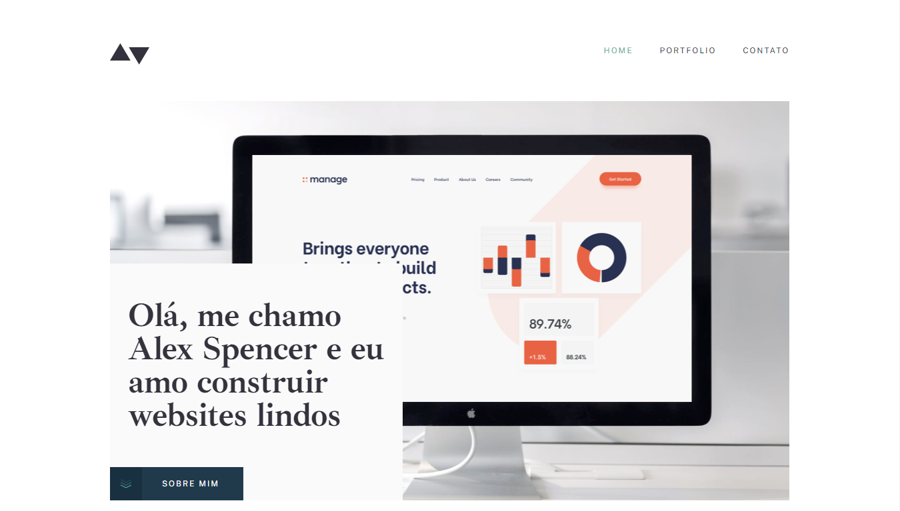
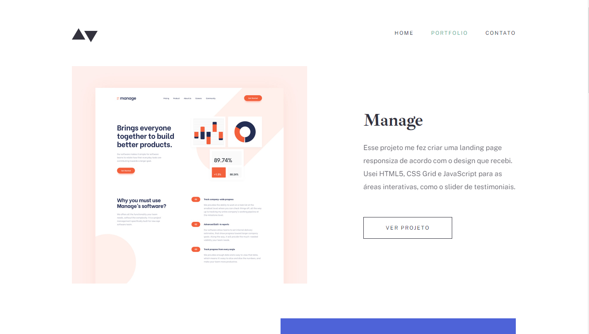
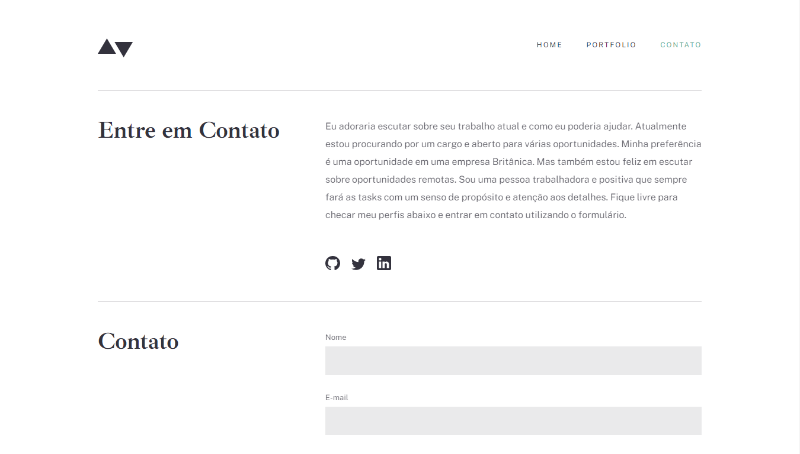

# Portfolio website with HTML and CSS only
Site made for the first challenge of Cubos Academy's FullStack software development course. In the construction process, only HTML and CSS were used.

## Project Images
 

## Author

| [ Victor Vinícius da Silva Galvão](https://github.com/victorvinicius33) 
| :---: |

 

